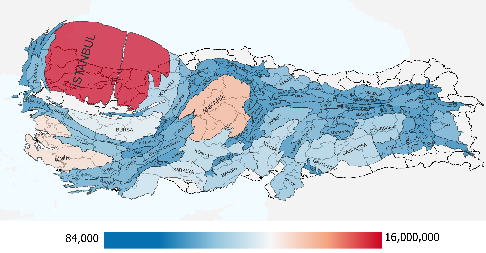
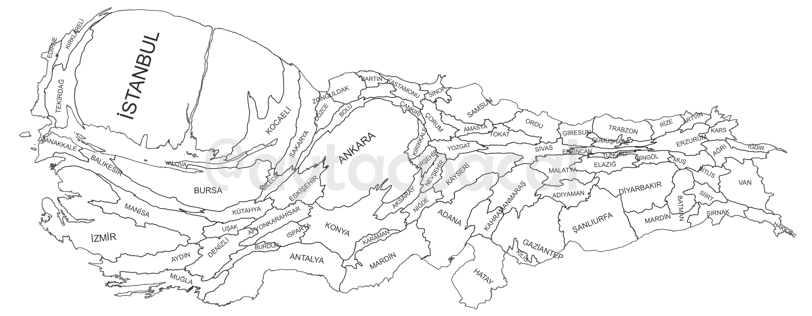

# Turkey Cartogram Population Map

Bu repository, Türkiye'nin illerinin nüfusa göre boyutlandırılmış haritalarını içerir. Türkiye İstatistik Kurumu'nun adrese dayalı nüfus sisteminden alınan 2022 yılı nüfus verileri kullanılmıştır. Kartogram haritalar [ScapeToad](https://github.com/christiankaiser/ScapeToad) ve [QGIS](https://www.qgis.org/en/site/) programları kullanarak [Humdata](https://data.humdata.org/dataset/cod-ab-tur) sitesinden alınan orijinal Türkiye shapefile dosyaları üzerinde oluşturulmuştur.

*This repository contains city maps of Turkey that have been drawn based on population data. The population data used in the maps are from the address-based population registration system of the Turkish Statistical Institute for 2022. The cartogram maps were created using [ScapeToad](https://github.com/christiankaiser/ScapeToad) and [QGIS](https://www.qgis.org/en/site/) software on the original Turkey shapefile files that were obtained from [Humdata](https://data.humdata.org/dataset/cod-ab-tur).*

## Kullanım
Bu repoyu klonlayarak veya indirerek kullanabilirsiniz. Daha sonra `nüfus_boyutlu.shp` dosyasını QGIS uygulamasıyla açabilirsiniz.

### *Usage*
*You can use this repo by cloning or downloading it. Then you can open `nüfus_boyutlu.shp` file with QGIS.*

## Lisans
Bu çalışma CC-BY-4.0 lisansı ile lisanslanmıştır. Bu lisansın detayları için [bu bağlantıyı](LICENSE) kullanabilirsiniz.

### *Licence*
*This work is licensed under the CC-BY-4.0 licence. You can use [this link](LICENSE) for details of this licence.*
